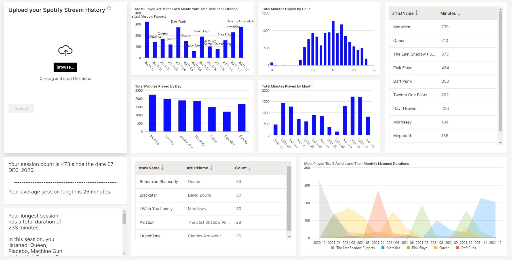

## Bio
I'm an experienced Data Analyst with Data Analytics Master Degree. Currently working as a Senior Data Analyst in Turkcell at AI and Business Intelligence team. I have experience as a data analytics projects business owner and as a sales analytics specialist. Also have experience in technology retail for 5 years, 1.5 years of it as planning team head.

I completed my master's degree in Data Analytics at Sabanci University in 2020 and also wrote data analytics content for the Analytics Vidyha Medium blog page and H20.ai.  You can see reach these articles on my portfolio website.

Portfolio: http://www.semihdesticioglu.com

Medium Articles: https://semihdesticioglu.medium.com/

H2O.ai Articles: https://h2o.ai/blog/how-to-create-your-spotify-eda-app-with-h2o-wave/

GitHub: https://github.com/semihdesticioglu

Skills:
* Programming: Python (Pandas, Sci-kit-learn, PySpark, Kafka Python Driver), SQL, PL/SQL, NoSQL
* Data Engineering: Data Modeling, Database Design & Management, ETL, Hadoop HDFS, Hadoop YARN, Hadoop MapReduce, Hive, Sqoop,
Kafka, Delta Lake, Airflow, Spark
* Data Visualization: Matplotlib, Microstrategy, Tableau
* Databases: Oracle, BigQuery, Firebase, Elasticsearch, Cassandra, MongoDB
* Cloud Services: AWS, Google Cloud, Heroku, IBM Cloud, H20.ai
* Web Scraping: Selenium, Beautiful Soup, Scrapy
* Containerization: Docker, Kubernetes
* Linux Basic and Bash Scripting
* Web/App Development: Flask, HTML, CSS, FlutterFlow
* Modelling: Supervised & Unsupervised Learning, Time Series Forecasting, Neural Networks, Deep Learning

## Portfolio

### Real-time IoT Sensor Data Dashboard

This project aims to visualize sensor data in real-time by utilizing Spark Streaming, Kafka, and Kibana. The dataset contains data from 255 sensors in 51 rooms across 4 floors of the Sutardja Dai Hall at UC Berkeley. The data includes CO2 concentration, humidity, temperature, light, and PIR motion sensor readings. 
The project involves 
* preprocessing the dataset with PySpark, 
* producing it into a Kafka topic, 
* consuming the topic with Spark Streaming, 
* and finally visualizing the data with Kibana on ElasticSearch.

Github Repo : [https://github.com/semihdesticioglu/Real-time-IoT-Sensor-Data-Dashboard](https://github.com/semihdesticioglu/Real-time-IoT-Sensor-Data-Dashboard)

---

### Spotify EDA App with H2O.ai 

I wrote an article about my Spotify Data Analysis Dashboard project which I produced with H20.ai tools. With this tool, you can upload your stream history and see your music history analysis.

Article Link: [https://h2o.ai/blog/how-to-create-your-spotify-eda-app-with-h2o-wave](https://h2o.ai/blog/how-to-create-your-spotify-eda-app-with-h2o-wave) 
Github Repo: [https://github.com/semihdesticioglu/SpotifyWaveApp](https://github.com/semihdesticioglu/SpotifyWaveApp)

 

---
### Covid-19 Dashboard Turkey 💻 📈 by Using Python 🐍

End-to-end dashboard project to visualize COVID 19 data of Turkey.
It is built using Python's Flask Web Framework and deployed on Heroku cloud.
Plotly library from Python is used to visualise data.
For front-end development bootstrap, javascript and CSS are used together on HTML.

Link to the app: [https://covid19turkiye.herokuapp.com/](https://covid19turkiye.herokuapp.com/)

 

---
### Turkcell AI Vision Challenge Contest / Deep Learning Project

Turkcell AI Vision Challenge competition was held in my company internally and I won the prize with my winning project. Out of 120 project, it is awarded as 1st. 
I created a CNN deep learning algorithm using Pytorch library and pre-trained Resnet-18 model with transfer learning approach.

Github Repo: [https://github.com/semihdesticioglu/t-ai-vision-challenge](https://github.com/semihdesticioglu/t-ai-vision-challenge)

 

---
### Airbnb Istanbul Data Analysis 

I analyzed Airbnb Istanbul data and answer some questions about the data. The project’s scope is exploratory data analysis with visuals and maps, applying a statistical test to data to answer the questions correctly.

All analyses are can be found on Medium Post : [https://medium.com/analytics-vidhya/airbnb-istanbul-data-analysis-b510c98a37e4](https://medium.com/analytics-vidhya/airbnb-istanbul-data-analysis-b510c98a37e4) 

Github Repo : [https://github.com/semihdesticioglu/airbnb_istanbul](https://github.com/semihdesticioglu/airbnb_istanbul)

---
### Amazon & MediaMarkt Smartphone Prices Web Scraping Project

This project aims to get smartphone and other devices' current prices from Amazon and MediaMarkt websites by web scraping.
Selenium, BeatifulSoup and Request libaries are used for scraping.
Scraping algorithm collects product models, brands, old and new prices from Amazon & MediaMarkt websites and build Pandas dataframes with these collections.

I was nominated to CXO prize with this RPA tool. It is used for monitoring the competitor prices in Turkcell. Tool was sending daily auto-emails with scraped price lists.

Github Repo : [https://github.com/semihdesticioglu/WebScrapingProject](https://github.com/semihdesticioglu/WebScrapingProject)

---

### Music App Churn Prediction with Pyspark on IBM Cloud Pak

In this project , I tried to create a churn model with the given data. Creating new features on feature engineering section added valueable improvements to the model.
Data processing done with PySpark on distributed environment.

You can find this project's Medium article on this link : [https://medium.com/@semihdesticioglu/predicting-music-app-churns-with-machine-learning-sparkify-project-dfc2ac2c695c](https://medium.com/@semihdesticioglu/predicting-music-app-churns-with-machine-learning-sparkify-project-dfc2ac2c695c)

---

### Disaster Response Project - Multioutput NLP Classifier

This project aims building a Natural Language Processing (NLP) model to categorize messages for possible disaster events that could happen in future.

In this project, I have built a Multioutput Classification model to predict message categories in future possible disasters.There are 36 pre-defined categories, and examples of these categories include Aid Related, Medical Help,Food, Death etc. By classifying these messages, we can help government or other aid organizations about prioritizing critical messases in possible disaster events. 

Github Repo : [https://github.com/semihdesticioglu/twitter-nlp-classifier](https://github.com/semihdesticioglu/twitter-nlp-classifier)

---

---

Page template forked from <a href="https://github.com/evanca/quick-portfolio">evanca</a>

<!-- Remove above link if you don't want to attibute -->
