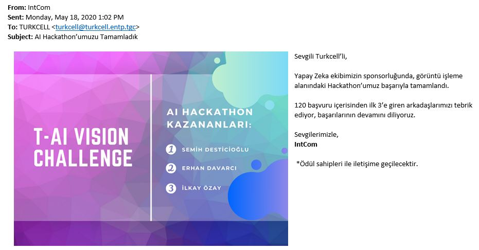
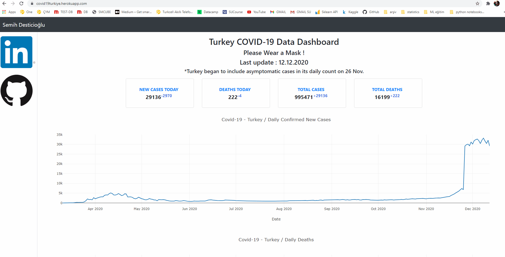

## Bio
I'm an experienced Data Analyst with Data Science Master Degree. Currently working as a Senior Expert Data Analyst in Turkcell at AI and Business Intelligence team. I have experience in B2B & Sales Analytics in sales business units and have business teams experience in technology retail at Teknosa for 5 years, 1.5 years of it as planning team head.

Completed my master's degree in Data Science at Sabanci University in 2020 and also writing data science content for  Analytics Vidyha Medium blog page and H20.ai.
I became the first in Turkcell AI Vision Challenge competition that was held in my company in May 2020 with my CNN deep learning model.

My Web Page with Portfolio: https://www.semihdesticioglu.com

Medium Articles: https://semihdesticioglu.medium.com/

Skills:
* Programming: SQL, PL/SQL, Python (Pandas, scikit-learn, Flask), Html, CSS
* Data Modelling, Database Design & Management
* Data Visualisation: Matplotlib, Microstrategy, Tableau, Qlikview, Power BI
* Relational Databases: Oracle SQL
* A/B Testing & Experimentation
* Cloud Services: AWS, Heroku, IBM Cloud, H20.ai
* Modeling: Supervised & Unsupervised Learning, Time Series Forecasting, Neural Networks, Deep Learning
* Web Scraping: Python (Selenium, BeatifulSoup)
* Web Development: Flask, Html, CSS, Bootstrap

## Portfolio

---

### Airbnb Istanbul Data Analysis 

I analyzed Airbnb Istanbul data and answer some questions about the data. The project’s scope is exploratory data analysis with visuals and maps, applying a statistical test to data to answer the questions correctly.

All analyses are can be found on Medium Post : [https://medium.com/analytics-vidhya/airbnb-istanbul-data-analysis-b510c98a37e4](https://medium.com/analytics-vidhya/airbnb-istanbul-data-analysis-b510c98a37e4) 

Github Repo : [https://github.com/semihdesticioglu/airbnb_istanbul](https://github.com/semihdesticioglu/airbnb_istanbul)

---
### Turkcell AI Vision Challenge Contest / Deep Learning Project

Turkcell AI Vision Challenge competition was held in my company internally and I won the prize with my winning project. Out of 120 project, it is awarded as 1st. 
I created a CNN deep learning algorithm using Pytorch library and pre-trained Resnet-18 model with transfer learning approach.

Github Repo: [https://github.com/semihdesticioglu/t-ai-vision-challenge](https://github.com/semihdesticioglu/t-ai-vision-challenge)

 

---

### Covid-19 Dashboard Turkey 💻 📈 by Using Python 🐍

End-to-end dashboard project to visualize COVID 19 data of Turkey.
It is built using Python's Flask Web Framework and deployed on Heroku cloud.
Plotly library from Python is used to visualise data.
For front-end development bootstrap, javascript and CSS are used together on HTML.

Link to the app: [https://covid19turkiye.herokuapp.com/](https://covid19turkiye.herokuapp.com/)

 

---

### Music App Churn Prediction with Pyspark on IBM Cloud Pak

In this project , I tried to create a churn model with the given data. Creating new features on feature engineering section added valueable improvements to the model.

You can find this project's Medium article on this link : [https://medium.com/@semihdesticioglu/predicting-music-app-churns-with-machine-learning-sparkify-project-dfc2ac2c695c](https://medium.com/@semihdesticioglu/predicting-music-app-churns-with-machine-learning-sparkify-project-dfc2ac2c695c)

---

### Sales Forecasting - Time Series Algorithms

In this project , I created a time series model with given sales data. I used ARIMAX and SARIMAX algorithms with external features.
There were some hidden features in data, like holiday and religious days. Adding those features to models decreased error rates.

Github Repo: [https://github.com/semihdesticioglu/SalesForecasting](https://github.com/semihdesticioglu/SalesForecasting)

---
### Amazon & MediaMarkt Smartphone Prices Web Scraping Project

This project aims to get smartphone and other devices' current prices from Amazon and MediaMarkt websites by web scraping.
Selenium, BeatifulSoup and Request libaries are used for scraping.
Scraping algorithm collects product models, brands, old and new prices from Amazon & MediaMarkt websites and build Pandas dataframes with these collections.

I was nominated to CXO prize with this RPA tool. It is used for monitoring the competitor prices in Turkcell. Tool was sending daily auto-emails with scraped price lists.

Github Repo : [https://github.com/semihdesticioglu/WebScrapingProject](https://github.com/semihdesticioglu/WebScrapingProject)

---

### Disaster Response Project - Multioutput NLP Classifier

This project aims building a Natural Language Processing (NLP) model to categorize messages for possible disaster events that could happen in future.

In this project, I have built a Multioutput Classification model to predict message categories in future possible disasters.There are 36 pre-defined categories, and examples of these categories include Aid Related, Medical Help,Food, Death etc. By classifying these messages, we can help government or other aid organizations about prioritizing critical messases in possible disaster events. 

Github Repo : [https://github.com/semihdesticioglu/twitter-nlp-classifier](https://github.com/semihdesticioglu/twitter-nlp-classifier)

---

### Creating My Own Python Package 

In this project, I created a Distribution Package . Package contains functions to make calculations for normal distributions, binomial distributions and Gaussian distributions. Package is uploaded to PyPi repository.

You can install my package with this command :  pip install distributions-semihdesticioglu==0.1

Github Repo : [https://github.com/semihdesticioglu/distributions-semihdesticioglu-0.1](https://github.com/semihdesticioglu/distributions-semihdesticioglu-0.1)

---

---

Page template forked from <a href="https://github.com/evanca/quick-portfolio">evanca</a>

<!-- Remove above link if you don't want to attibute -->
